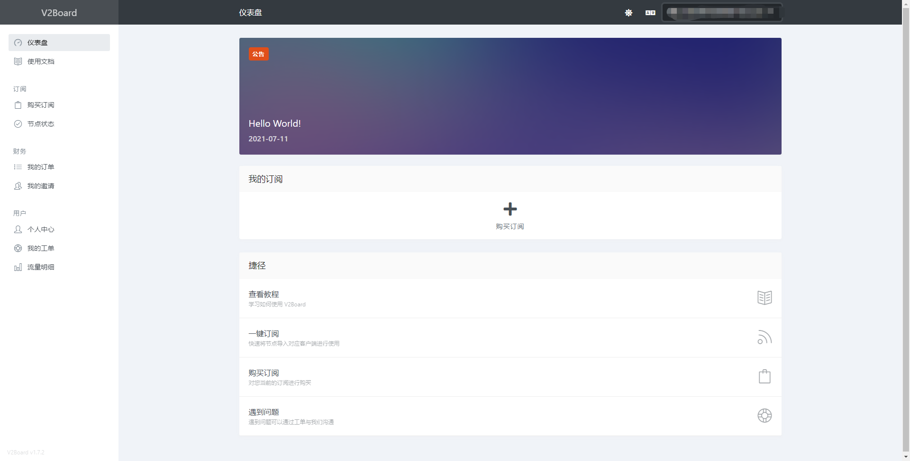
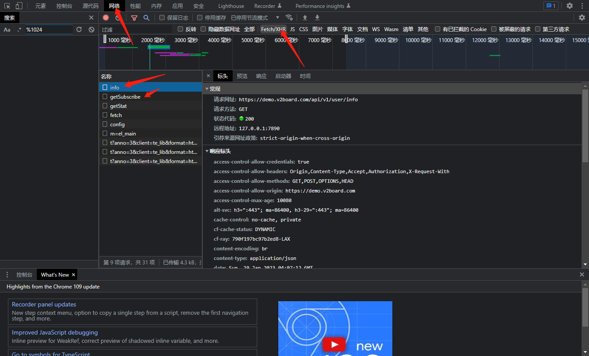

# Qbot
## 简介
qbot基于[go-cqhttp](https://github.com/Mrs4s/go-cqhttp)的qq机器人  
未来将用于闹钟、自动报警、等功能。  
## 使用
### 1、安装go-cqhttp
1.1、前往[go-cqthhp下载页面](https://github.com/Mrs4s/go-cqhttp/releases)下载对应版本文件  
1.2、根据[go-cqhttp配置](https://docs.go-cqhttp.org/guide/config.html#%E9%85%8D%E7%BD%AE)自行配置文件并开启http通信。  
1.3、修改config.yml中的servers这两项地址自己修改。  
~~~
- http: # HTTP 通信设置
      address: 0.0.0.0:5700 # HTTP监听地址
      post:           # 反向HTTP POST地址列表
      - url: http://127.0.0.1:5701/ # 地址
~~~
1.4、运行go-cqhttp  
  
### 2、启动qqbot
2.1、下载本仓库的[release](https://github.com/EasonHelloWord/qqbot-based-go-cqhttp/releases)并解压  
2.2、运行server.py  
2.3、打开生成的config.yml而不是config_backup.yml配置服务器地址和端口与cq-http同步  
2.5、至此服务启动完毕

### 3、配置vpn查询服务
3.1、vpn查询功能暂时只支持基于[v2board框架](https://github.com/v2board/v2board)的vpn服务提供商(界面如图所示)  

3.2、配置文件编辑  
3.3、在vpn网站中登录，并记录请求数据，方法如图所示

如果这里没东西刷新一下网页就好了。  
3.4、记录info与getSubscribe的请求网址和响应标头，分别填入config.yml中的vpn中request:info_path、info_headers、getSubscribe_path、getSubscribe_heasers  
3.5、请保证config.yml中的vpn能每一项都填写完整没有注释掉的项目。  
3.6、至此配置完毕，向机器人qq发送.vpn或.vpn_all测试。  